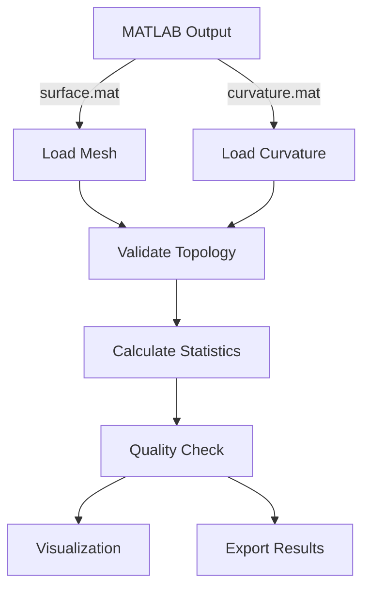

# MeshAnalyzer

A Python package for quantitative analysis of 3D mesh data generated by u-shape3D, designed for morphological characterization of single cell images from fluorescence microscopy.

## Overview

MeshAnalyzer provides a robust, type-safe framework for analyzing triangulated surface meshes and their associated curvature data. Built specifically for the u-shape3D pipeline, it bridges MATLAB mesh generation with Python's scientific computing ecosystem.

### Key Features

- **Type-Safe Data Structures**: Immutable dataclasses for self-documenting, validated results
- **Comprehensive Mesh Analysis**: Volume, surface area, topology, and quality metrics
- **Curvature Analysis**: Mean and Gaussian curvature with full distribution statistics
- **Physical Units**: Automatic conversion from pixels to micrometers
- **Visualization**: Mesh plotting and visualisation 
- **Quality Assurance**: Automatic mesh validation and warning system
- **Data Export**: JSON results and PLY mesh export for external tools

## Installation

### Quick Install

```bash
cd /path/to/Scripts
conda activate your_environment
pip install -e .
```

The `-e` flag installs in **editable mode**, allowing you to modify source code without reinstalling.

### Prerequisites

Dependencies are automatically installed:
- `numpy>=1.20.0`
- `scipy>=1.7.0`
- `matplotlib>=3.4.0`
- `vedo>=2023.4.0`
- `mat73>=0.59`
- `h5py>=3.0.0`

### Verify Installation

```bash
python -c "from MeshAnalyzer import MeshAnalyzer; print('✓ Installation successful')"
```

## Quick Start

```python
from MeshAnalyzer import MeshAnalyzer

# Initialize with microscope-specific pixel sizes
analyzer = MeshAnalyzer(
    surface_path='surface_1_1.mat',
    curvature_path='meanCurvature_1_1.mat',
    pixel_size_xy=0.1661,  # 166.1 nm
    pixel_size_z=0.5       # 500 nm
)

# Load and analyze
analyzer.load_data()
results = analyzer.calculate_statistics()

# Print summary
print(results.summary())

# Access specific metrics
print(f"Volume: {results.mesh_stats.volume_um3:.2f} μm³")
print(f"Mean curvature: {results.curvature_stats.mean:.4f}")
```

---

## Core Concepts

### 1. Analysis Pipeline



### 2. Data Structures

#### MeshStatistics (Frozen Dataclass)
Geometric and topological properties:
- `n_vertices`, `n_faces`, `n_edges`: Mesh topology
- `volume_pixels3`, `volume_um3`: Volume in different units
- `surface_area_pixels2`, `surface_area_um2`: Surface area
- `is_watertight`: Mesh closure status (critical for volume)
- `euler_number`: Topological invariant (genus detection)

#### CurvatureStatistics (Frozen Dataclass)
Distribution metrics:
- `mean`, `std`, `sem`, `median`: Central tendency and spread
- `min`, `max`: Range
- `percentiles`: Dict with keys [1, 5, 25, 50, 75, 95, 99]

#### QualityMetrics (Frozen Dataclass)
Mesh quality indicators:
- `mean_edge_length`, `std_edge_length`: Mesh uniformity
- `mean_face_area`, `std_face_area`: Triangle sizing
- `aspect_ratio_mean`, `aspect_ratio_std`: Triangle shape quality

**Automatic Warnings:**
- Aspect ratio >3.0: Elongated triangles affecting accuracy
- Edge CV >0.5: Non-uniform mesh requiring inspection

### 3. Curvature Types

MeshAnalyzer supports multiple curvature measures:

**Mean Curvature** (default):
- Average of principal curvatures: H = (κ₁ + κ₂)/2
- Sign convention: positive = convex (blebs), negative = concave (invaginations)
- Best for detecting protrusions and membrane dynamics

**Gaussian Curvature** (available via `load_gauss_data()`):
- Product of principal curvatures: K = κ₁ × κ₂
- Intrinsic geometric property (independent of embedding)
- Detects saddle points (K<0), peaks/valleys (K>0), flat regions (K=0)

**Raw vs. Smoothed**:
- Smoothed curvature (default): u-shape3D post-processing for noise reduction
- Raw curvature (`load_curvature_data_raw()`): Unfiltered for quality control

---

## Complete API Reference

### MeshAnalyzer Class

#### Initialization

```python
MeshAnalyzer(surface_path: str, curvature_path: str,
             pixel_size_xy: float = None, pixel_size_z: float = None)
```

**Parameters:**
- `surface_path`: Path to surface .mat file (vertices, faces)
- `curvature_path`: Path to curvature .mat file
- `pixel_size_xy`: XY pixel size in μm (default: 0.1)
- `pixel_size_z`: Z pixel size in μm (default: 0.1)

**Class Constants:**
- `VERSION = "1.0.0"`
- `SUPPORTED_FORMATS = ['.mat', '.h5']`

#### Methods

**`load_data(verbose: bool = True) -> None`**
Load mesh and curvature from MATLAB files. Automatically:
- Fixes inverted meshes (negative volume)
- Validates curvature array length
- Reports loading progress if verbose

**`calculate_statistics(force_recalculate: bool = False) -> AnalysisResults`**
Compute comprehensive statistics. Uses caching to avoid redundant calculations.

**`calculate_statistics_dict() -> Dict`**
Legacy method returning dictionary format for backwards compatibility.

#### Properties

**`is_loaded -> bool`**
Check if data has been successfully loaded.

**`physical_dimensions -> Dict[str, float]`**
Returns cell bounding box in micrometers:
```python
dims = analyzer.physical_dimensions
# {'x_um': 12.5, 'y_um': 15.3, 'z_um': 8.7}
```

#### Context Manager Support

```python
with MeshAnalyzer(surface_path, curvature_path,
                  pixel_size_xy=0.1661) as analyzer:
    results = analyzer.calculate_statistics()
    # Data automatically loaded, resources cleaned up
```

#### Magic Methods

**`__str__()`**: User-friendly representation for `print(analyzer)`
**`__repr__()`**: Developer representation with file names

---

### I/O Functions (`MeshAnalyzer.io`)

All functions accessible via `from MeshAnalyzer import function_name`.

#### Core Loading Functions

**`load_surface_data(filepath: Path) -> Tuple[np.ndarray, np.ndarray, vedo.Mesh]`**
```python
vertices, faces, mesh = load_surface_data('surface_1_1.mat')
# vertices: (N, 3) array of XYZ coordinates
# faces: (M, 3) array of triangle indices (0-based)
# mesh: vedo.Mesh object for analysis
```

**`load_curvature_data(filepath: Path, expected_length: int) -> np.ndarray`**
Load smoothed mean curvature values. Validates array length against face count.

**`load_curvature_data_raw(filepath: Path) -> np.ndarray`**
Load unsmoothed mean curvature for quality control and preprocessing validation.
```python
curv_raw = load_curvature_data_raw('meanCurvature_1_1.mat')
# Access 'meanCurvatureUnsmoothed' field
```

**`load_gauss_data(filepath: Path) -> np.ndarray`**
Load Gaussian curvature data for advanced geometric analysis.
```python
gauss_curv = load_gauss_data('meanCurvature_1_1.mat')
# Access 'gaussCurvatureUnsmoothed' field
# Useful for detecting saddle points and topological features
```

#### Export Functions

**`save_mesh_to_ply(mesh: vedo.Mesh, filepath: Path) -> None`**
Export mesh to PLY format for external tools (MeshLab, CloudCompare, Blender).
```python
from MeshAnalyzer.io import save_mesh_to_ply
save_mesh_to_ply(analyzer.mesh, 'cell_mesh.ply')
```

**`save_results_to_json(results: dict, filepath: Path) -> None`**
Persist analysis results in structured JSON format.
```python
from MeshAnalyzer.io import save_results_to_json
stats_dict = analyzer.calculate_statistics_dict()
save_results_to_json(stats_dict, 'analysis_results.json')
```

---

### Utility Functions (`MeshAnalyzer.utils`)

**`calculate_mesh_quality_metrics(mesh: vedo.Mesh, verbose: bool = False) -> QualityMetrics`**
Comprehensive mesh quality analysis. Returns dataclass with:
- Edge length statistics (mean, std, min, max)
- Face area statistics
- Aspect ratio analysis
```python
from MeshAnalyzer.utils import calculate_mesh_quality_metrics
quality = calculate_mesh_quality_metrics(analyzer.mesh, verbose=True)
warnings = quality.get_warnings()  # Automatic quality checks
```

**`calculate_surface_roughness(curvature: np.ndarray) -> float`**
Surface roughness metric based on curvature variation.
```python
from MeshAnalyzer.utils import calculate_surface_roughness
roughness = calculate_surface_roughness(analyzer.curvature)
# Returns: std(|curvature|) - higher values = rougher surface
```

**`find_high_curvature_regions(curvature: np.ndarray, threshold: float = 2.0) -> np.ndarray`**
Identify regions with high curvature (protrusions, invaginations).
```python
from MeshAnalyzer.utils import find_high_curvature_regions
mask = find_high_curvature_regions(analyzer.curvature, threshold=3.0)
n_high_curvature = mask.sum()
print(f"Detected {n_high_curvature} high-curvature faces")
```

**`convert_pixels_to_um(value: float, pixel_size: float) -> float`**
Simple unit conversion utility.

---

### Visualization Functions (`MeshAnalyzer.visualization`)

#### Figure Styling

All plots use:
- Font: Arial 8pt
- DPI: 300
- Line width: 0.5pt
- No top/right spines
- Color palette: `NATURE_COLORS` dict

**Available colors:**
```python
from MeshAnalyzer.visualization import NATURE_COLORS
# {'blue': '#2E86AB', 'red': '#E63946', 'gray': '#6C757D',
#  'light_gray': '#ADB5BD', 'dark_gray': '#343A40',
#  'green': '#028A0F', 'orange': '#F77F00'}
```

#### Plotting Functions

**`plot_curvature_distribution(curvature: np.ndarray, save_path: str = None) -> plt.Figure`**
Dual-panel histogram: linear and log scale.
```python
from MeshAnalyzer import plot_curvature_distribution
fig = plot_curvature_distribution(analyzer.curvature, save_path='curvature_dist.pdf')
```

**`basic_spatial_plot(mesh, curvature: np.ndarray, save_path: str = None, title: str = ...) -> Tuple[plt.Figure, plt.Axes]`**
2D/3D spatial visualization of curvature distribution.
```python
from MeshAnalyzer import basic_spatial_plot
fig, ax = basic_spatial_plot(analyzer.mesh, analyzer.curvature,
                             title="Spatial Curvature Map")
# Features:
# - Face centers colored by curvature
# - Symmetric RdBu colormap (red=positive, blue=negative)
# - 95th percentile robust scaling
# - Statistics box overlay
# - Equal aspect ratio (no distortion)
```

---

## Examples Gallery

### Example 1: Basic Analysis

```python
from MeshAnalyzer import MeshAnalyzer

analyzer = MeshAnalyzer('surface_1_1.mat', 'meanCurvature_1_1.mat',
                        pixel_size_xy=0.1661, pixel_size_z=0.5)
analyzer.load_data()
results = analyzer.calculate_statistics()

# Automated summary report
print(results.summary())
```

**Output:**
```
=== Analysis Summary ===
Vertices: 37,680
Faces: 75,360
Volume: 262.32 μm³
Surface Area: 1,847.56 μm²

Curvature: 0.0123 ± 0.0456
Range: [-0.2341, 0.3124]
```

### Example 2: Spatial Curvature Visualization

```python
from MeshAnalyzer import MeshAnalyzer, basic_spatial_plot

analyzer = MeshAnalyzer('surface_1_1.mat', 'meanCurvature_1_1.mat')
analyzer.load_data()

# Create spatial map
fig, ax = basic_spatial_plot(
    analyzer.mesh,
    analyzer.curvature,
    title="Neutrophil Membrane Curvature",
    save_path="spatial_curvature.pdf"
)
```

### Example 3: Quality Control Workflow

```python
from MeshAnalyzer import MeshAnalyzer

analyzer = MeshAnalyzer('surface_1_1.mat', 'meanCurvature_1_1.mat')
analyzer.load_data()
results = analyzer.calculate_statistics()

# Check mesh topology
if not results.mesh_stats.is_watertight:
    print("⚠ WARNING: Mesh is not watertight - volume may be inaccurate")
    print(f"Euler number: {results.mesh_stats.euler_number}")

# Check mesh quality
warnings = results.quality_metrics.get_warnings()
if warnings:
    print("⚠ QUALITY WARNINGS:")
    for w in warnings:
        print(f"  - {w}")
else:
    print("✓ Mesh quality passed all checks")

# Check for extreme curvature values
if abs(results.curvature_stats.mean) > 0.1:
    print(f"⚠ Unusually high mean curvature: {results.curvature_stats.mean:.4f}")
```

### Example 4: Raw vs. Smoothed Curvature

```python
from MeshAnalyzer import MeshAnalyzer
from MeshAnalyzer.io import load_curvature_data_raw
import matplotlib.pyplot as plt

analyzer = MeshAnalyzer('surface_1_1.mat', 'meanCurvature_1_1.mat')
analyzer.load_data()

# Load both versions
curv_smoothed = analyzer.curvature
curv_raw = load_curvature_data_raw(analyzer.curvature_path)

# Compare distributions
fig, (ax1, ax2) = plt.subplots(1, 2, figsize=(12, 5))

ax1.hist(curv_raw, bins=100, alpha=0.7, label='Raw')
ax1.set_title('Raw Curvature')
ax1.set_xlabel('Curvature (1/pixels)')

ax2.hist(curv_smoothed, bins=100, alpha=0.7, label='Smoothed', color='orange')
ax2.set_title('Smoothed Curvature')
ax2.set_xlabel('Curvature (1/pixels)')

plt.tight_layout()
plt.savefig('curvature_comparison.pdf')
```

### Example 5: Gaussian Curvature Analysis

```python
from MeshAnalyzer import MeshAnalyzer
from MeshAnalyzer.io import load_gauss_data
import numpy as np

analyzer = MeshAnalyzer('surface_1_1.mat', 'meanCurvature_1_1.mat')
analyzer.load_data()

# Load Gaussian curvature
gauss_curv = load_gauss_data(analyzer.curvature_path)

# Classify surface regions
saddle_points = gauss_curv < -0.01  # Negative Gaussian curvature
peaks_valleys = gauss_curv > 0.01   # Positive Gaussian curvature
flat_regions = np.abs(gauss_curv) <= 0.01  # Near-zero

print(f"Saddle points: {saddle_points.sum()} faces ({100*saddle_points.mean():.1f}%)")
print(f"Peaks/valleys: {peaks_valleys.sum()} faces ({100*peaks_valleys.mean():.1f}%)")
print(f"Flat regions: {flat_regions.sum()} faces ({100*flat_regions.mean():.1f}%)")
```

### Example 6: High Curvature Region Detection

```python
from MeshAnalyzer import MeshAnalyzer
from MeshAnalyzer.utils import find_high_curvature_regions, calculate_surface_roughness

analyzer = MeshAnalyzer('surface_1_1.mat', 'meanCurvature_1_1.mat')
analyzer.load_data()

# Detect protrusions/invaginations
high_curv_mask = find_high_curvature_regions(analyzer.curvature, threshold=2.5)
n_protrusions = high_curv_mask.sum()
pct_protrusions = 100 * high_curv_mask.mean()

print(f"High curvature regions: {n_protrusions} faces ({pct_protrusions:.1f}%)")

# Calculate surface roughness
roughness = calculate_surface_roughness(analyzer.curvature)
print(f"Surface roughness: {roughness:.4f}")
```

### Example 7: Batch Processing

```python
from MeshAnalyzer import MeshAnalyzer
from pathlib import Path
import pandas as pd

# Process multiple cells
data_dir = Path('/Volumes/T7/Analysis_Neutros/Batch1')
results_list = []

for surface_file in data_dir.glob('**/surface_*.mat'):
    curv_file = surface_file.parent / surface_file.name.replace('surface', 'meanCurvature')

    if curv_file.exists():
        analyzer = MeshAnalyzer(str(surface_file), str(curv_file),
                                pixel_size_xy=0.1661, pixel_size_z=0.5)
        analyzer.load_data(verbose=False)
        results = analyzer.calculate_statistics()

        results_list.append({
            'cell_id': surface_file.stem,
            'volume_um3': results.mesh_stats.volume_um3,
            'surface_area_um2': results.mesh_stats.surface_area_um2,
            'mean_curvature': results.curvature_stats.mean,
            'curvature_std': results.curvature_stats.std,
        })

# Create DataFrame
df = pd.DataFrame(results_list)
df.to_csv('batch_analysis_results.csv', index=False)
print(f"Processed {len(df)} cells")
```

### Example 8: Export for External Tools

```python
from MeshAnalyzer import MeshAnalyzer
from MeshAnalyzer.io import save_mesh_to_ply, save_results_to_json

analyzer = MeshAnalyzer('surface_1_1.mat', 'meanCurvature_1_1.mat')
analyzer.load_data()
results = analyzer.calculate_statistics()

# Export mesh for MeshLab/Blender
save_mesh_to_ply(analyzer.mesh, 'cell_mesh.ply')

# Export results for archival/sharing
stats_dict = analyzer.calculate_statistics_dict()
save_results_to_json(stats_dict, 'analysis_results.json')

print("✓ Exported PLY mesh and JSON results")
```

---

## Scientific Background

### Curvature Interpretation

**Mean Curvature (H)**:
- **H > 0**: Convex surface (blebs, protrusions, filopodia tips)
- **H < 0**: Concave surface (invaginations, phagocytic cups)
- **H ≈ 0**: Saddle points or locally flat regions
- **Units**: 1/μm (inverse length)

**Gaussian Curvature (K)**:
- **K > 0**: Elliptic points (peaks, pits, spherical regions)
- **K < 0**: Hyperbolic points (saddle-shaped, membrane ruffles)
- **K = 0**: Parabolic points (cylindrical regions, edges)
- **Topological significance**: ∫∫K dA = 2πχ (Gauss-Bonnet theorem)

### Quality Metrics Thresholds

**Aspect Ratio**:
- **< 2.0**: Excellent triangle quality
- **2.0-3.0**: Acceptable
- **> 3.0**: Warning - elongated triangles may affect accuracy

**Edge Length Coefficient of Variation**:
- **< 0.3**: Uniform mesh
- **0.3-0.5**: Acceptable variation
- **> 0.5**: Warning - non-uniform mesh, check segmentation

**Watertight Status**:
- **True**: Closed surface, valid volume calculation
- **False**: Open mesh, volume unreliable, check for holes

### Statistical Measures

**Standard Error of Mean (SEM)**:
- SEM = σ/√n
- Estimates precision of population mean
- Smaller SEM = more reliable mean estimate

**Percentiles**:
- Robust statistics less affected by outliers
- Default percentiles: [1, 5, 25, 50, 75, 95, 99]
- Use 5th/95th for outlier detection
- Use 25th/75th for interquartile range

**Surface Roughness**:
- Defined as σ(|κ|) where κ is curvature
- Captures surface texture independent of mean curvature
- Higher roughness = more membrane undulations

---

## Best Practices

### 1. Always Specify Pixel Sizes

```python
# ✓ CORRECT: Microscope-specific calibration
analyzer = MeshAnalyzer(surface_path, curvature_path,
                        pixel_size_xy=0.1661,  # From microscope metadata
                        pixel_size_z=0.5)

# ✗ WRONG: Using defaults
analyzer = MeshAnalyzer(surface_path, curvature_path)
# Defaults to 0.1 μm - likely incorrect for your system
```

### 2. Validate Before Analysis

```python
# Check data loaded correctly
assert analyzer.is_loaded, "Data not loaded"

# Check mesh quality
results = analyzer.calculate_statistics()
if not results.mesh_stats.is_watertight:
    print("WARNING: Open mesh detected")

# Check for quality issues
warnings = results.quality_metrics.get_warnings()
if warnings:
    print("WARNING:", warnings)
```

### 3. Use Type-Safe Access

```python
# ✓ GOOD: Type-safe, IDE autocomplete
volume = results.mesh_stats.volume_um3

# ✗ AVOID: Dictionary access, prone to typos
volume = stats_dict['mesh']['volume_um3']  # No IDE help
```

### 4. Compare Raw and Smoothed Data

```python
# Quality control: Check smoothing artifacts
from MeshAnalyzer.io import load_curvature_data_raw
curv_raw = load_curvature_data_raw(curvature_path)
curv_smoothed = analyzer.curvature

# Excessive smoothing if std reduced >50%
std_ratio = np.std(curv_smoothed) / np.std(curv_raw)
if std_ratio < 0.5:
    print("WARNING: Aggressive smoothing detected")
```

### 5. Use Context Managers for Clean Code

```python
# Automatic resource management
with MeshAnalyzer(surface_path, curvature_path) as analyzer:
    results = analyzer.calculate_statistics()
    # Processing here
# Resources automatically cleaned up
```

---

## Troubleshooting

### FileNotFoundError
- **Cause**: Incorrect path or file doesn't exist
- **Solution**: Use absolute paths or verify file location
```python
from pathlib import Path
surface_path = Path('surface_1_1.mat').resolve()
assert surface_path.exists(), f"File not found: {surface_path}"
```

### ValueError: Curvature length mismatch
- **Cause**: Curvature array doesn't match number of faces
- **Solution**: Verify files are from same u-shape3D run
```python
# Check file consistency
surface_data = loadmat('surface_1_1.mat')
curv_data = loadmat('meanCurvature_1_1.mat')
n_faces = len(surface_data['surface']['faces'])
n_curvature = len(curv_data['meanCurvature'])
print(f"Faces: {n_faces}, Curvature values: {n_curvature}")
```

### MemoryError with Large Meshes
- **Cause**: Mesh > 10M faces exceeds available RAM
- **Solution**: Downsample in u-shape3D or increase system memory
```python
# Check mesh size before loading
surface_data = loadmat('surface_1_1.mat')
n_faces = len(surface_data['surface']['faces'])
estimated_memory_mb = n_faces * 200 / 1e6  # Rough estimate
print(f"Estimated memory: {estimated_memory_mb:.1f} MB")
```

### Mesh Quality Warnings
- **High aspect ratio**: Elongated triangles from poor segmentation
  - Solution: Adjust u-shape3D smoothing parameters
- **High edge length variation**: Non-uniform mesh
  - Solution: Check image quality and segmentation settings

### Negative Volume
- **Cause**: Inverted mesh normals (faces wound incorrectly)
- **Solution**: Automatically fixed by `load_data()` via `mesh.reverse()`
```python
analyzer.load_data()
if analyzer.mesh.volume() < 0:
    print("Mesh was inverted, automatically corrected")
```

---

## Contributing

We welcome contributions! Guidelines:

1. **Code Style**:
   - Type hints for all parameters and returns
   - Docstrings in NumPy format
   - Black formatting (line length 100)

2. **Testing**:
   - Unit tests for new functionality
   - Pytest framework
   - Minimum 80% code coverage

3. **Compatibility**:
   - Maintain backwards compatibility
   - Support Python 3.8+
   - Document breaking changes

4. **Documentation**:
   - Update README for new features
   - Add examples to gallery
   - Include scientific justification

---

## License

See main repository for license information.

---

## Citation

If you use MeshAnalyzer in your research, please cite:

```bibtex
@software{meshanalyzer2025,
  title={MeshAnalyzer: Type-Safe Python Framework for 3D Mesh Analysis},
  author={Philipp Kaintoch},
  year={2025},
  version={1.0.0},
  url={https://github.com/philius19/MeshAnalyzer}
}
```

---

## Acknowledgments

Built on u-shape3D by the Danuser Lab at UT Southwestern Medical Center. MeshAnalyzer extends the u-shape3D MATLAB pipeline with modern Python tooling for advanced morphological analysis of immune cells and other biological specimens.

**Version:** 1.0.0
**Last Updated:** November 2025
